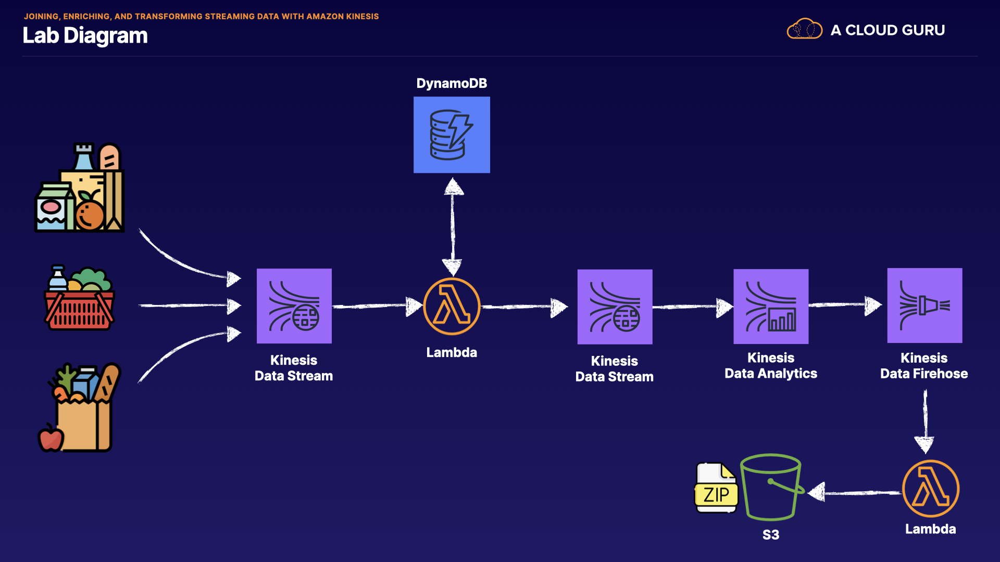

# CDK streaming application
## Overview
This is a sample CDK streaming application, similar to the ACloudGuru example.

## Architecture

## Usage
 * `cdk deploy`
 * `cd scripts && node populate_user_info_table.js`        compare deployed stack with current state
 * `cd scripts && node ingest_orders.js`
 * `cdk watch`
